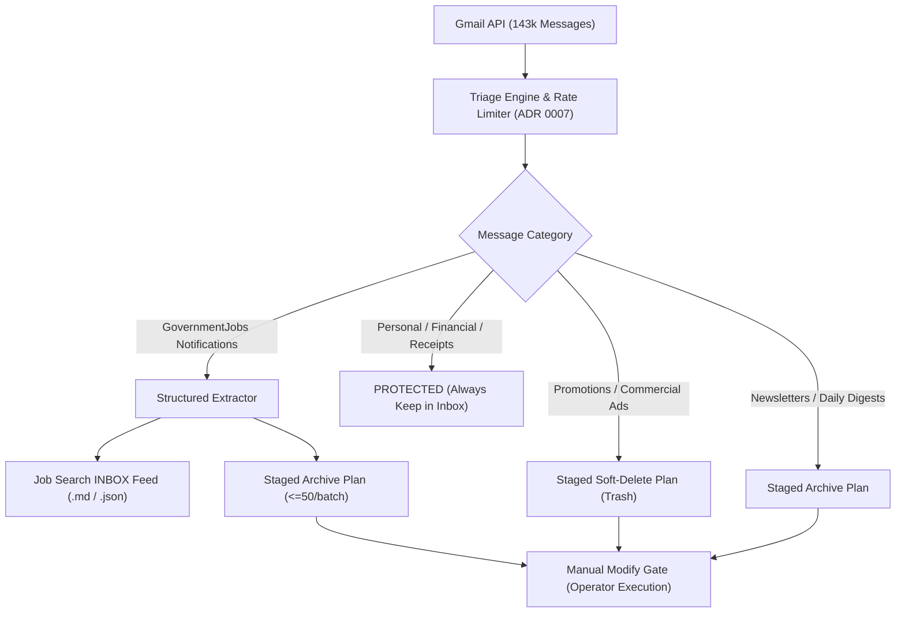

# Wayfinder Ticket: Autonomous AFK Inbox Triage & Opportunity Extraction Pipeline

**Status:** Active (Phase 1: GovernmentJobs Extractor & Triage Evals Verified)  
**Type:** `wayfinder:task`  
**Created:** 2026-09-10  
**Workspace:** `/Users/mag_station/Dev_Tools/Gmail-API`  
**Downstream Consumer:** `/Users/mag_station/Documents/Job Search`  
**Governing ADRs:** [ADR 0001](docs/adr/0001-user-executed-send-gate.md), [ADR 0003](docs/adr/0003-separate-retrieval-and-transmission-credentials.md), [ADR 0007](docs/adr/0007-separate-service-throttling-from-content-disclosure.md), [ADR 0008](docs/adr/0008-attachment-staging-and-audit-log-retention.md), [ADR 0010](docs/adr/0010-staged-cleanup-plan-and-manual-modify-gate.md).  
**Predecessor Tickets:** [WAYFINDER_GMAIL_API_MODIFY_ACCESS.md](WAYFINDER_GMAIL_API_MODIFY_ACCESS.md) (Completed and verified 2026-09-10).

---

## 1. Question

How can an autonomous agent safely, deterministically, and accurately classify a high-volume personal inbox (143k+ messages) AFK into actionable streams (opportunity extraction, newsletter archiving, promotional soft-deletion, and strict retention of sensitive/personal communications) backed by an automated evaluation benchmark (`evals/run_evals.py`) and gated by the Manual Modify Gate?

---

## 2. Destination

An auditable, long-horizon AFK triage pipeline operating locally that:

1. **Executes Structured Opportunity Extraction**:
   - Parses deterministic notification streams (e.g., `info@governmentjobs.com`) into structured opportunities (`agency`, `title`, `job_id`, `url`, `date`).
   - Syncs active postings to the Operator's primary Job Search folder (`/Users/mag_station/Documents/Job Search/INBOX/`).
   - Categorizes roles against [`JOB_SEARCH_RUNBOOK.md`](/Users/mag_station/Documents/Job%20Search/JOB_SEARCH_RUNBOOK.md) into priority tiers (Tier 1: Data, Systems, Programming, Analysis; Tier 2: Public Service, Inspection; Tier 3: General).

2. **Guarantees Safety via Boundary Evals ([ADR 0010](docs/adr/0010-staged-cleanup-plan-and-manual-modify-gate.md))**:
   - Rigorous evaluation suite in `evals/test_triage_policy.py` verifying:
     - 100% extraction precision on schema-driven alert emails.
     - Zero false-positive trashing on protected emails (receipts, tax records, personal mail, legal correspondence, 2FA codes).
     - Strict batch size limits ($\le 50$ targets per staged plan).

3. **Operates Unattended AFK with Gated Execution**:
   - AI agents run batch extraction and scan routines asynchronously without polling loops.
   - Outputs staged, fingerprinted `CleanupPlan` artifacts (`~/.local/state/gmail-local/plans/<fingerprint>.json`).
   - Only the Operator can mutate Gmail state via `gmail-local cleanup apply --plan <fp> --confirm`.

---

## 3. Architecture & Data Flow

---

## 4. Verified Phase 1 & 2 Progress

- [x] Tested and verified schema extraction on live `info@governmentjobs.com` messages.
- [x] Extracted 275 unique job postings across 98 notification emails (30-day window).
- [x] Mapped postings to [`JOB_SEARCH_RUNBOOK.md`](/Users/mag_station/Documents/Job%20Search/JOB_SEARCH_RUNBOOK.md) criteria (97 Tier-1 High Match roles identified).
- [x] Generated live markdown feed: [`/Users/mag_station/Documents/Job Search/INBOX/GovernmentJobs_Live_Feed_2026-09-10.md`](file:///Users/mag_station/Documents/Job%20Search/INBOX/GovernmentJobs_Live_Feed_2026-09-10.md).
- [x] Generated structured data feed: [`/Users/mag_station/Documents/Job Search/INBOX/governmentjobs_feed.json`](file:///Users/mag_station/Documents/Job%20Search/INBOX/governmentjobs_feed.json).
- [x] Implemented production `src/gmail_local/triage.py` engine and CLI subcommands (`scan`, `plan`, `clusters`, `policy`).
- [x] Interactive policy calibration completed and saved to `~/.config/gmail-local/triage_policy.json` with strict operator whitelists (Home Depot, Ralphs, GasBuddy, The Athletic, Lennar/Lennox, Streamable, Linux Foundation, Chuck E Cheese).
- [x] Implemented ADR 0013 expanding batch ceiling to 75 targets and added paginated cluster discovery up to 500 candidates.
- [x] Executed 4 staged deletion batches (234 total promotional messages moved to Trash via Manual Modify Gate with zero false positives).
- [ ] Continue scaling autonomous AFK triage pipeline across historical and active promotional backlogs.

