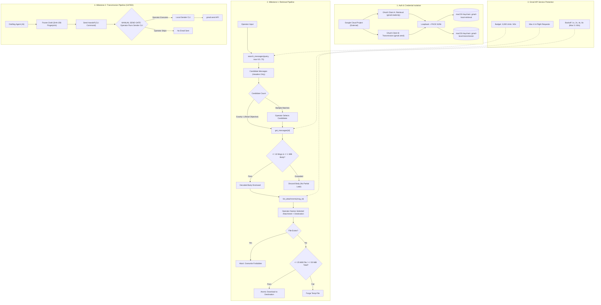

# Gmail Local Integration Architecture

```mermaid
flowchart TD
    %% 1. Auth & Credentials
    subgraph Auth ["1. Auth & Credential Isolation"]
        GCP["Google Cloud Project (External)"] --> ClientRead["OAuth Client A: Retrieval (gmail.readonly)"]
        GCP --> ClientSend["OAuth Client B: Transmission (gmail.send)"]
        ClientRead --> PKCE["Loopback + PKCE S256"] --> KeyRead[("macOS Keychain: gmail-local-retrieval")]
        ClientSend --> PKCE --> KeySend[("macOS Keychain: gmail-local-transmission")]
    end

    %% 2. Retrieval Pipeline
    subgraph Retrieval ["2. Milestone 1: Retrieval Pipeline"]
        Operator["Operator Input"] --> Search["search_messages(query, max=10..75)"]
        Search --> Candidates["Candidate Messages (Headers Only)"]
        Candidates --> EvalCount{"Candidate Count"}
        EvalCount -- "Exactly 1 (Read Objective)" --> ReadMsg["get_messages(id)"]
        EvalCount -- "Multiple Matches" --> PickMsg["Operator Selects Candidates"] --> ReadMsg
        
        ReadMsg --> CheckLimit{"<= 10 Msgs & <= 1 MiB Body?"}
        CheckLimit -- "Pass" --> SafeBody["Decoded Body Disclosed"]
        CheckLimit -- "Exceeded" --> DropBody["Discard Body (No Partial Leak)"]
        
        SafeBody --> ListAtt["list_attachments(msg_id)"]
        ListAtt --> SelectAtt["Operator Names Selected Attachment + Destination"]
        SelectAtt --> CheckFile{"File Exists?"}
        CheckFile -- "Yes" --> AbortFile["Abort: Overwrite Forbidden"]
        CheckFile -- "No" --> CheckSize{"<= 25 MiB File / <= 50 MiB Total?"}
        CheckSize -- "Pass" --> Download["Atomic Download to Destination"]
        CheckSize -- "Fail" --> Purge["Purge Temp File"]
    end

    %% 3. Service Throttle
    subgraph Throttle ["3. Gmail API Service Protection"]
        Budget["Budget: 3,000 Units / 60s"] -.-> Search
        Concur["Max 4 In-Flight Requests"] -.-> ReadMsg
        Retry["Backoff: 1s, 2s, 4s, 8s (Max 5 / 60s)"] -.-> ListAtt
    end

    %% 4. Transmission Pipeline
    subgraph Transmission ["4. Milestone 2: Transmission Pipeline (GATED)"]
        Agent["Drafting Agent (AI)"] --> Frozen["Frozen Draft (SHA-256 Fingerprint)"]
        Frozen --> Handoff["Send Handoff (CLI Command)"]
        Handoff --> Gate{"MANUAL SEND GATE: Operator Runs Sender CLI"}
        Gate -- "Operator Executes" --> Sender["Local Sender CLI"] --> SendAPI["gmail.send API"]
        Gate -- "Operator Skips" --> NoSend["No Email Sent"]
    end
```
