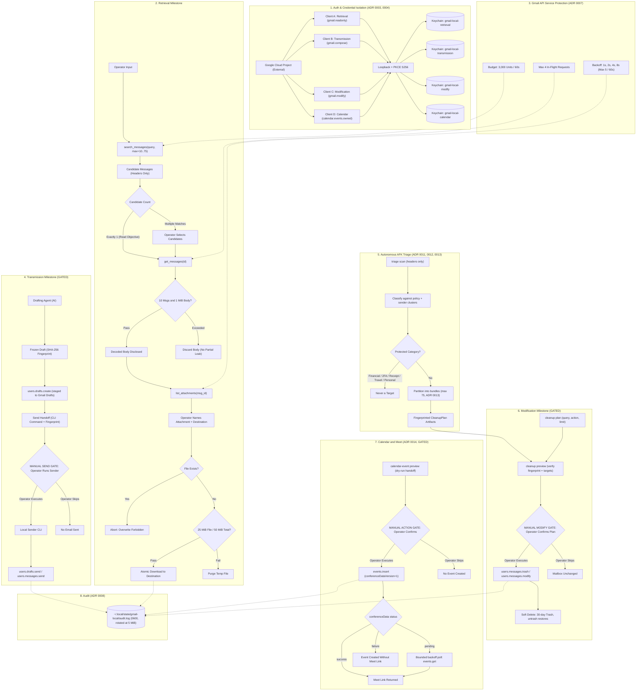

# Gmail Local Integration Architecture

Each capability runs on its own OAuth grant, its own client secret, and its own
Keychain entry, and every write is held behind a manual gate the Operator must
execute. See `docs/adr/` for the governing decisions.

