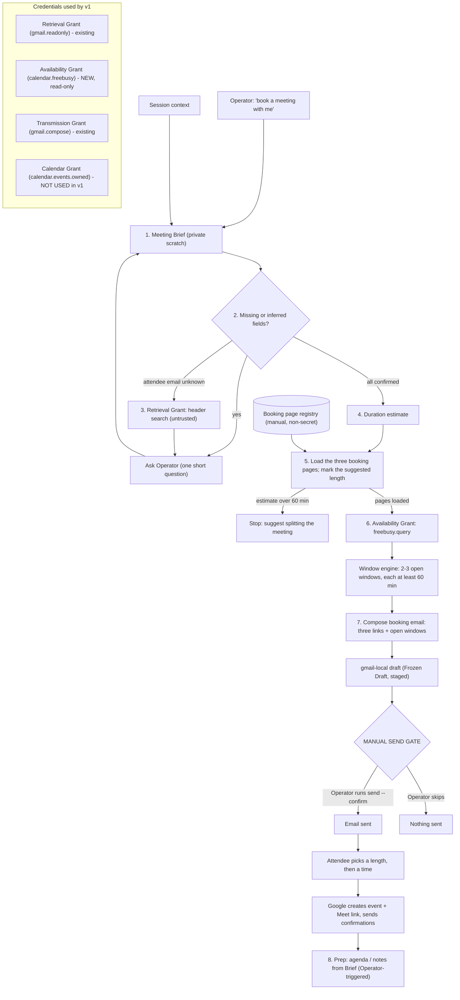
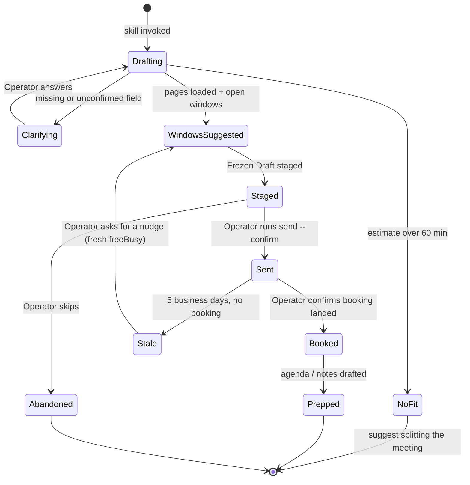
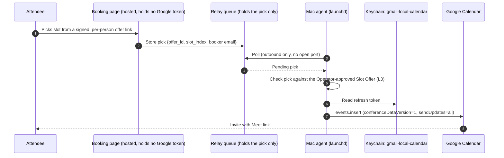

# Book-a-Meeting Skill: v1 System Design

**Status:** Draft design, 2026-09-28. Not implementation authorization. Per
`AGENTS.md`, new implementation work, OAuth setup, and live Google access each
need the Operator's separate authorization.

**Invocation:** "book a meeting with me", "set a meeting time with me".

---

## 0. v1 scope

| In v1 | Deferred to v2+ |
|---|---|
| Online meetings only | In-person, phone, hybrid |
| Share all three booking pages (30 / 45 / 60 min); the attendee picks the length (Google AI Pro) | Our code creating any event |
| freeBusy check that suggests 2-3 open windows next to the links | Our code minting any video link (Calendar `conferenceData`, Meet REST, or other video services) |
| Meeting Brief scratch notes, duration estimate, agenda draft | Reschedule / cancel |
| Attendee address lookup through the Retrieval Grant (untrusted) | ICS files (Google sends the invite on booking) |
| Booking email through Frozen Draft + Manual Send Gate | Pre-authorized Slot Offer (section 8) |

In v1 the Meet link comes only from the booking page's own conferencing
setting. The skill never creates, reads, or logs a Meet link.

**ADR 0014 is not used by v1.** Nothing in v1 calls the Calendar Grant.
ADR 0014 matters only for the wording change needed to add a second,
read-only calendar grant (section 8).

---

## 1. Confirmed / Unknown / Assumed

**Confirmed (primary sources)**
- `freebusy.query` accepts `calendar.readonly`, `calendar`,
  `calendar.events.freebusy`, or `calendar.freebusy`. The shipped
  `calendar.events.owned` is not on that list.
- `calendar.freebusy` is described as "View your availability in your calendars."
- No official Google document describes an API to create or read appointment
  schedules (booking pages). They are created by hand in Calendar on a computer.
- A free personal account gets one booking page. More than one schedule needs
  Google One Premium, Google AI Pro, or Google AI Ultra (or a Workspace tier).
- Booking-page conferencing is a per-page setting. "Google Meet video
  conferencing" is one of the four options.
- "Check calendars for availability" is opt-in per page. The default minimum
  lead time is 4 hours.
- The shipped OAuth flow (`auth.py:163-169`) requests exactly the grant's scopes
  and does not use `include_granted_scopes`. It also does not verify the granted
  scopes after login.

**Decided by the Operator (2026-09-28)**
- Plan tier: **Google AI Pro.** Per Google's comparison chart this allows more than
  one appointment schedule, so there is one page per duration. Setup confirms it
  (section 10, step 2).
- Page durations: **30, 45, and 60 minutes.**
- Length: **the attendee picks.** The email carries all three links. The skill's
  estimate is shown only as a suggestion.
- Booking detection: the Operator says "they booked" (section 3.8).
- Registry location: **`~/.config/book-meeting/`** (skill-owned, section 3.5).

**Unknown**
- Whether Google's booking confirmation gives the booker a reschedule or cancel
  path, and what it looks like.
- Whether the Availability Grant's Desktop client belongs in the shared Google
  Cloud project. That is the open question in issue #5, which now covers five
  clients instead of four.

**Assumed (verify during setup)**
- The booking page shows times in the booker's local time zone.
- The three pages can be given identical hours, buffer, notice, advance window,
  and checked calendars, so one availability check covers all of them.

---

## 2. v1 architecture



---

## 3. Stages

### 3.1 Meeting Brief (scratch schema)

The skill's working note. Every field says where it came from. A field marked
`inferred`, `session`, or `retrieval` must not reach an email or an event until
it is `confirmed`.

```yaml
brief_id: mb-20260928-7f3a            # local only
state: drafting                       # see section 5
title:        {value: "Q4 budget walkthrough", source: inferred, evidence: "session: 'walk Dana through the Q4 numbers'"}
purpose:      {value: "Review Q4 budget draft before Friday submission", source: inferred}
modality:     {value: online, source: fixed_v1}
suggested_length_min: {value: 30, source: inferred, rationale: "single-document review, 2 people"}
attendees:
  - name:  {value: "Dana Ruiz", source: session}
    email: {value: "dana@example.org", source: retrieval, confirmed: false}
window:       {earliest: 2026-09-29, latest: 2026-10-10, source: inferred}
timezone:     {organizer: America/Los_Angeles, attendee: {value: null, source: unknown}}
agenda:
  - "Walk through Q4 line items"
  - "Decide on travel budget cut"
pre_reads: ["Q4 budget draft (not attached in v1)"]
booking:
  pages: [30m, 45m, 60m]              # all three go in the email
  suggested_windows: []               # filled by section 3.6
  freebusy_snapshot_at: null
email:
  draft_id: null
  fingerprint: null
```

**Where it lives:** the session scratchpad, or a `0600` skill-owned state
directory (`~/.local/state/book-meeting/briefs/`). Never the repo, the audit
log, or ordinary config. It holds attendee addresses and agenda text.

### 3.2 Clarify rules

Ask only for what is missing or unconfirmed, at most one question at a time.

| Field | Rule |
|---|---|
| Purpose / title | Infer from context. Ask only if there is nothing to infer from. |
| Attendee name | Infer. Ask if ambiguous (two people with the same first name in context). |
| Attendee email | **Always confirm with the Operator** unless the Operator typed it in this session. |
| Suggested length | Infer (3.4). Show the reason in one line; the Operator can override. The attendee still picks. |
| Window | Default: next business day through 10 business days out. |
| Modality | Fixed to online in v1. If context says in-person, stop and say v1 does not cover it. |

### 3.3 Attendee address lookup (Retrieval Grant)

Used only when the address isn't in the session.

```bash
gmail-local search "from:dana OR to:dana newer_than:180d" --limit 10 --purpose book_meeting_address_lookup
```

- Headers only. No bodies are read for this.
- Every address found is **untrusted** (`source: retrieval, confirmed: false`).
  Email content cannot authorize a downstream action, so a found address stays
  a suggestion until the Operator confirms it.
- Several matches are listed for the Operator to choose from. The skill never
  guesses.

### 3.4 Duration estimate

A small heuristic. The attendee picks the actual length; the estimate only
decides which length the email suggests. Under 30 minutes suggests 30. Over 60
stops the flow, because no page fits.

| Meeting shape | Base (min) | Adjust |
|---|---|---|
| One decision / quick question | 15 | +15 if more than 3 attendees |
| Check-in / status | 30 | |
| First meeting / intro | 30 | |
| Review one document or proposal | 30 | +15 if no pre-read exists |
| Working session / problem solving | 60 | |
| Multi-topic planning | 60 | Over 60 min: suggest splitting |

The skill states the result as one line, for example "30 min: single-document
review with one attendee."

### 3.5 Booking page registry

Google gives no API for booking pages, so the Operator creates the pages by hand
and registers them once. The Operator is on Google AI Pro, so there is one page
per length: 30, 45, and 60 minutes. The file is not secret (anyone with the URL can book), but
it stays outside the repo.

**Location:** `~/.config/book-meeting/booking_pages.json`. A skill-owned
namespace moves with the skill if it is ever split out (section 8.4).

```json
{
  "version": 1,
  "organizer_timezone": "America/Los_Angeles",
  "shared_settings": {
    "conferencing": "google_meet",
    "weekly_hours": {
      "mon": [["09:00", "12:00"], ["13:00", "17:00"]],
      "tue": [["09:00", "17:00"]],
      "wed": [["09:00", "17:00"]],
      "thu": [["09:00", "17:00"]],
      "fri": [["09:00", "12:00"]]
    },
    "buffer_min": 0,
    "min_notice_hours": 4,
    "max_advance_days": 60,
    "checks_calendar_availability": true,
    "availability_calendars": ["primary"]
  },
  "pages": [
    {"key": "30m", "duration_min": 30, "url": "https://calendar.app.google/XXXXXXXX"},
    {"key": "45m", "duration_min": 45, "url": "https://calendar.app.google/YYYYYYYY"},
    {"key": "60m", "duration_min": 60, "url": "https://calendar.app.google/ZZZZZZZZ"}
  ],
  "verified_on": "2026-09-28"
}
```

- `shared_settings` **mirror the settings all three pages share.** Setup makes the
  pages match so one availability check covers them. If a page is changed and
  the registry isn't, suggestions can disagree with it. `verified_on` shows how
  stale the file is.
- `conferencing` must be `google_meet` in v1. The skill refuses any other value.
- **Exactly three pages: 30, 45, and 60 minutes.** The skill refuses a registry
  missing any of them, so the email always offers all three.
- **The attendee picks the length.** The estimate (3.4) only chooses which
  length the email suggests.
- `availability_calendars` lists the calendars the pages check. Google AI Pro can
  check more than one, and the freeBusy call must use the same list (3.6).

### 3.6 Availability and window engine

A new read-only CLI command on the new Availability Grant. The window math is
deterministic code, not model arithmetic, so it can be tested offline.

```bash
gmail-local availability windows \
  --from 2026-09-29 --to 2026-10-10 --timezone America/Los_Angeles \
  --calendars primary --hours-json <weekly_hours from shared_settings> \
  --buffer 0 --min-notice 4h --max-advance 60d \
  --min-length 60 --count 3 \
  --purpose book_meeting_windows
```

It returns open **windows**, not exact slots: free stretches inside the weekly
hours that are at least 60 minutes long, so any of the three lengths fits.
Because they are windows, the pages' exact slot layout doesn't matter.

Output: `start`/`end` pairs and `snapshot_at`, nothing else. freeBusy returns only
busy blocks, so no event titles or attendees ever enter the agent's context.

The freeBusy `items` must be `availability_calendars`. Google AI Pro lets a page
check more than one calendar; if the lists differ, suggested windows can
disagree with the pages.

Suggested windows are **not held.** The email says so, and the booking page is the
source of truth at booking time.

### 3.7 Booking email and Manual Send Gate

Template (plain, short):

```text
Subject: Picking a time: {title}

Hi {first_name},

{one-line purpose}. It's a Google Meet call. I think {suggested_length} minutes
covers it, but pick whatever length works for you:

  30 minutes: {url_30m}
  45 minutes: {url_45m}
  1 hour:     {url_60m}

I'm generally open during these windows ({organizer_tz}):
  - {window_1}
  - {window_2}
  - {window_3}

Those aren't held, so the page will show what's still open when you book.
The Meet link comes with the confirmation.

{optional: agenda bullets}

{signature}
```

Staging uses the existing Transmission lane without changes:

```bash
gmail-local draft --to "{confirmed_email}" --subject "Picking a time: {title}" \
  --body-file {scratch}/booking_email.txt --purpose book_meeting_invite
# -> Frozen Draft fingerprint + send handoff
gmail-local send --draft {draft_id} --confirm --purpose book_meeting_invite   # Operator runs this
```

### 3.8 After booking (decided: Operator says so)

Google creates the event with the Meet link and emails both sides. In v1 the
Operator tells the skill "they booked," and the Brief moves to `booked`. No
grant is used and nothing is read. Options considered:

| Option | Grant | Data exposure | Notes |
|---|---|---|---|
| **Operator says "they booked"** | none | none | **Chosen for v1.** |
| Retrieval search for Google's booking-confirmation email | Retrieval | headers | Sender and subject format unverified |
| `events.list` on primary | Calendar Grant (write-capable) | full event content | Loads the write token for a read. Not recommended. |
| `freebusy` recheck of the suggested window | Availability | busy blocks only | Can't tell *which* meeting filled the slot |

After it's marked booked: the skill drafts an agenda / notes page from the Brief.
The Meet link stays in Google's event and emails and is not copied into the Brief.

---

## 4. Where the Meet link comes from (v1)

```mermaid
sequenceDiagram
    autonumber
    participant Op as Operator
    participant GP as Google booking page (manual setup)
    participant Sk as Skill
    participant At as Attendee
    participant GC as Google Calendar

    Op->>GP: Create 30 / 45 / 60 min schedules, Google Meet, check availability = on
    Op->>Sk: Register the three URLs + shared settings (registry)
    Sk->>At: Email with three links + open windows (after Manual Send Gate)
    At->>GP: Picks a length, then a slot; fills name + email
    GP->>GC: Creates event on Operator's calendar
    GC->>GC: Generates Meet link for this event
    GC-->>At: Confirmation with Meet link
    GC-->>Op: Event with Meet link on calendar
    Note over Sk: Skill never creates, reads, or logs the Meet link
```

**Rules**
1. The only Meet source in v1 is the page's conferencing setting. Setup must
   confirm the setting is "Google Meet video conferencing."
2. The skill never pre-mints a link. Rejected: Meet REST `spaces.create`
   (`meetings.space.created`) would create a link before any time is agreed.
   That leaves orphan spaces, needs a new API and scope, and is outside
   ADR 0014 and v1.
3. The Meet URL does not enter the Brief, the audit log, or the booking email.
   The booking email says the link arrives with the confirmation.
4. Reschedule or cancel: whatever Google's booking flow provides (Unknown,
   section 1). In v1 the skill does not touch the event.

For v2 direct booking, ADR 0014's `conferenceData.createRequest` path is already
built. Section 9 lists what it's missing.

---

## 5. Booking request states



`Stale` never re-sends by itself. A nudge is a new draft through the same Send Gate.

---

## 6. Pseudocode

```python
def book_meeting(session_ctx, registry, now):
    brief = infer_brief(session_ctx)                      # model step; every field tagged with source
    brief.modality = "online"                             # fixed in v1
    if context_says_in_person(session_ctx):
        return stop("v1 covers online meetings only")

    while (field := first_unresolved(brief)) is not None:
        if field.path.endswith(".email") and field.value is None:
            candidates = retrieval_header_search(field.owner_name)   # untrusted suggestions
            field.value = ask_operator_to_pick(candidates)
        else:
            field.value = ask_operator(field)
        field.source, field.confirmed = "operator", True

    estimate, reason = estimate_duration(brief)             # table in 3.4
    if estimate > 60:
        return stop("Over 60 min: no booking page fits; suggest splitting")
    pages = load_pages(registry)                            # exactly 30m, 45m, 60m
    brief.suggested_length_min = min(p.duration_min for p in pages if p.duration_min >= estimate)

    s = registry.shared_settings
    windows = cli("availability windows", window=brief.window, tz=registry.organizer_timezone,
                  calendars=s.availability_calendars, hours=s.weekly_hours,
                  buffer=s.buffer_min, min_notice=s.min_notice_hours,
                  max_advance=s.max_advance_days, min_length=60, count=3)
    brief.booking.suggested_windows = windows
    brief.booking.freebusy_snapshot_at = now

    body = render_booking_email(brief, pages, brief.suggested_length_min, windows)
    body_path = write_private(scratch_dir, body)
    draft = cli("draft", to=confirmed_emails(brief), subject=f"Picking a time: {brief.title}",
                body_file=body_path, purpose="book_meeting_invite")
    brief.email.draft_id, brief.email.fingerprint = draft.id, draft.fingerprint
    brief.state = "staged"
    return send_handoff(draft)            # Operator runs `gmail-local send --draft ... --confirm`


REQUIRED_LENGTHS = [30, 45, 60]

def load_pages(registry):
    if registry.shared_settings.conferencing != "google_meet":
        raise RegistryError("v1 requires Google Meet booking pages only")
    lengths = sorted(p.duration_min for p in registry.pages)
    if lengths != REQUIRED_LENGTHS:
        raise RegistryError(f"Expected pages for 30, 45, 60 min; found {lengths}")
    return sorted(registry.pages, key=lambda p: p.duration_min)


def open_windows(busy, s, window, tz, now, min_length, count):
    """Deterministic. Lives in the CLI, not the skill."""
    earliest = max(window.start, now + hours(s.min_notice_hours))
    latest = min(window.end, now + days(s.max_advance_days))
    padded_busy = [(b.start - minutes(s.buffer_min), b.end + minutes(s.buffer_min)) for b in busy]
    found = []
    for day in each_day(earliest, latest, tz):
        for start_hm, end_hm in s.weekly_hours.get(day.weekday_key, []):
            block = clip((day.at(start_hm), day.at(end_hm)), earliest, latest)
            for free in subtract(block, padded_busy):
                if free.end - free.start >= minutes(min_length):
                    found.append(free)
    return spread(found, count)   # prefer different days, then AM/PM mix
```

---

## 7. New pieces v1 needs

| Piece | Where | Notes |
|---|---|---|
| Availability Grant | `gmail-local availability-login / -status / -revoke` | Scope `calendar.freebusy` only. Own Desktop client (`client_secret_availability.json`) and Keychain `gmail-local-availability`. After login, check that the granted scopes equal the requested scopes; stop if any write scope appears. |
| `availability windows` command | new `availability.py` + CLI | freeBusy + window engine. Audit entry: operation, date range, window count. No event data exists to leak. |
| Booking page registry | `~/.config/book-meeting/booking_pages.json` | Three pages + shared settings, created by the Operator. Skill-owned, not gmail-local config. |
| Skill | user-level skills directory | Orchestration only. Calls the CLI; holds no credentials. |
| ADR 0016 | `docs/adr/` | Availability Grant (section 8). Numbered after #5, which claims ADR 0015. |
| `AGENTS.md`, architecture diagram | repo | Add the Availability Grant line and diagram node. |

Nothing in v1 changes the Calendar Grant, `calendar.py`, or the Transmission lane.

---

## 8. Due diligence: loosening ADR 0014 and a future split

### 8.1 The decision

Should ADR 0014 be loosened so a booking capability can (a) read availability
without a gate, (b) later let a pre-approved offer stand in for per-event
confirmation, and (c) eventually move the calendar code into its own directory?

**API route, checked through:** the Calendar API can read availability and create
events, but it cannot create or manage a booking page. A self-serve link built on
the API alone would need L3 (deferred), L4 (no-go), or L5 (conditional, v2) below. That is why v1 uses
Google's booking page for the link and the API only for availability.

Stake: moderate. These are credential-boundary decisions, and a wrong call puts
a write-capable token on an unattended path. Every option below can be reversed
by revoking a token.

### 8.2 How much ADR 0014 actually touches this

| ADR 0014 decision | Effect on v1 |
|---|---|
| 1. Scope + Keychain isolation | **Wording only.** It says calendar scopes stay on the Calendar Grant; `AGENTS.md` repeats it for `calendar.events.owned`. A second calendar grant is additive but needs to be written down. |
| 2. Meet through the Calendar API | None. v1 mints no links. |
| 3. Deterministic event ID / 409 | None. v1 creates no events. |
| 4. Manual Action Gate | None. Google's page creates the event, not our code. |
| 5. Audit redaction | Same principle carried into the new `availability` audit entry. |

### 8.3 Options

| # | Option | Changes | Verdict |
|---|---|---|---|
| L1 | **Separate Availability Grant** (`calendar.freebusy`, own Desktop client, client secret, and Keychain entry) | ADR 0016 + `AGENTS.md` line. ADR 0014 text unchanged. | **Go, with conditions** (below) |
| L2 | Add `calendar.freebusy` to the Calendar Grant | Amends ADR 0014 decision 1. Re-consent. | **No-go.** Every unattended availability lookup would load a write-capable token, and revoking one would revoke both. |
| L3 | Pre-authorized Slot Offer (Operator approves a fingerprinted set of slots once; a pick inside it counts as confirmed) | Amends ADR 0014 decision 4 | **Defer.** v1 doesn't need it because Google's page does the booking. Red flag: the pick would arrive by email, and `AGENTS.md` says email content cannot authorize a downstream action. It would need explicit "selects, doesn't authorize" wording and a bounded-harm argument. |
| L4 | Hosted booking server holding the Calendar token | New ADR; token leaves Keychain | **No-go.** Breaks the Keychain-only credential rule. |
| L5 | **Mac-resident booking agent**: our own page (hosted, no token) collects the pick; a local agent on the Mac creates the event with the token it already has | New ADR; needs L3 for the gate | **Conditional, v2 candidate.** See below. |

**L5 in more detail (Operator suggestion, 2026-09-28)**

The token stays on the Mac, so L4's objection goes away. It should stay in the
Keychain itself, not in a Keychain-like file store: `AGENTS.md` bans refresh
tokens in ordinary configuration files, and a local agent can read the Keychain
directly.



What still has to be settled before L5 is a go:
1. **The gate.** The booker's click is not Operator confirmation. L5 only works
   together with L3 (the Operator approves the offer once and the pick selects
   from it), so L3's red flag carries over.
2. **The Mac has to be awake and logged in** for a booking to finish. Otherwise
   the pick waits in the relay and the attendee gets no instant confirmation.
3. **The relay holds booker names and emails.** It needs a retention limit and
   no logging of that content.
4. **Double-booking between the pick and the insert.** The agent re-runs freeBusy
   before inserting and declines if the slot filled.
5. **Scope.** It creates events and Meet links from our code, which v1 excluded.

**L1 conditions (what would prove it safe)**
1. Offline test: `AuthManager.for_availability().scopes == ["https://www.googleapis.com/auth/calendar.freebusy"]`.
2. After login, the granted scopes in the token response equal the requested
   scopes. Any extra scope stops the login and discards the token.
3. Live check (needs separate authorization): `freebusy.query` succeeds with the
   token and `events.insert` fails with 403.
4. `availability-revoke` clears only `gmail-local-availability`.

**Client model:** the grant gets its own Desktop OAuth client and
`client_secret_availability.json`, matching the one-client-per-grant pattern the
four existing grants follow (ADR 0004, 0010, 0014). Reusing the Calendar
client's secret was considered and dropped: it saves one setup step but breaks
that pattern and would make condition 2 depend on Google's token behavior.

**What would change the verdict:** issue #5 deciding that calendar-family
clients move to their own Google Cloud project. The Availability Grant would
move with the Calendar Grant.

**Exit condition:** any availability token that carries a write scope ends L1
until the cause is found.

### 8.4 Future split into its own directory (dependency scan)

**What's changing (future):** the calendar code and the new availability code
move out of `src/gmail_local/` into their own package or directory.

**Prior tracker history:** issue #4 (closed) proposed renaming the CLI and
package and was closed as the wrong layer, because renaming Keychain services
orphans stored tokens. Issue #5 (open) covers the layer that matters, the shared
Google Cloud project. This scan agrees with both: keep Keychain service names,
and treat the project boundary as #5's decision.

**Search method (re-runnable):**
```bash
grep -n "^from\|gmail_local" src/gmail_local/calendar.py
rg -n -i calendar src/gmail_local --glob '!calendar.py' --glob '!cli.py'
rg -l -i calendar tests evals *.md docs
```

**Blocking** (must be handled before the move)
- Keychain service `gmail-local-calendar` (`config.py:46`) holds the live refresh
  token. Renaming it orphans the token. Mitigation: keep the service names as-is
  after the move.
- The audit log is shared (`config.py:53`, `AuditEntry` in `models.py:62`).
  ADR 0014's redaction guarantee has to survive the move, so the redaction tests
  move with the code.

**Fix-after** (mechanical)
- `calendar.py:12` imports `MAX_EVENT_ATTENDEES` from `config`.
- `calendar.py:191-193` import `AuditLogger`, `AuthManager`, `RateLimiter`.
- `calendar.py:212, 269` import `Attendee`, `CalendarEvent`, `CalendarPreview`,
  `ConferenceData`, `AuditEntry` (`models.py:551-690`).
- `AuthManager.for_calendar` (`auth.py:115-136`), including the
  `client_secret_meet.json` fallback.
- CLI wiring: `cli.py:204-340` and `cli.py:1364-1400`.
- Rate limiting: calendar calls go through the Gmail quota limiter and are
  charged the default 20 units (`rate_limiter.py:80`). Calendar has its own
  quotas, so it needs its own limiter after the split.
- Tests: `tests/test_calendar.py` (10 tests), plus calendar cases in
  `test_cli.py`, `test_auth.py`, and `test_models.py`.

**Watch**
- The parent workspace map `Dev_Tools/AGENTS.md` describes Gmail-API's grants
  and needs a line when the Availability Grant lands.
- Docs that mention calendar: `README.md`, `AGENTS.md`, `CONTEXT.md`,
  `docs/architecture_diagram.md` §7, `docs/agent-cookbook.md`,
  `docs/calendar_meet_api_official_research.md`, `docs/ics_gmail_attachment_research.md`, ADR 0014.
- `evals/` has no calendar coverage today, so a split loses nothing there. It
  also means there are no eval guards.

**Ignore**
- `text/calendar` MIME handling in `retrieval.py:301-304`, `composer.py:83-91`,
  and `models.py:262-286`. That is Gmail ICS attachment handling and stays with
  gmail-local.

**Recommended approach:** don't move anything now. Build v1 so a later move is
mechanical:
- `availability.py` as its own module with its own `AuthManager` factory, and no
  imports from `retrieval`, `composer`, or `triage`.
- The skill-owned registry and state (`~/.config/book-meeting/`,
  `~/.local/state/book-meeting/`) instead of gmail-local paths.
- The window engine as pure functions with offline tests.

**Post-move smoke test:** `calendar-status` and `availability-status` both show
a token present without re-login, and `pytest tests/test_calendar.py` passes.

**Verdict:** build v1 with these seams; hold the physical move.

---

## 9. Deferred to v2 (from the ADR 0014 code review)

These gaps in the shipped Calendar Grant code only matter once our code creates
events:

1. No `location` field in the insert body (`calendar.py`), so in-person can't be expressed.
2. `CalendarConferenceError` is raised before `audit_logger.record`. The event can exist with no audit entry.
3. No `events.patch`. Because the event ID includes start/end, creating the event again at a new time makes a second event with a second Meet link.
4. No way to add a Meet link to an existing event after Meet creation failed (patch with a fresh `requestId`).
5. The 409 path doesn't check for `status == "cancelled"`. Whether Google returns 409 for a deleted event's ID is unverified.
6. The receipt doesn't include `iCalUID`. v2 ICS files need it to avoid a second copy of the event.
7. The CLI default `--send-updates none` means attendees never get the Meet link. Direct booking must pass `all`.

v2 ICS rule: only produce an ICS file when Google did not already send the
invite, and set its UID to the event's `iCalUID`. Build it through the
`create-event` skill's `build_ics.py` + `validate_ics.py`; never write ICS by hand.

---

## 10. Operator setup checklist (manual, one time)

1. Durations: 30, 45, and 60 minutes (section 3.5).
2. In Google Calendar on a computer: Create → Appointment schedule, once per
   duration. Creating the second schedule confirms Google AI Pro allows it.
3. Give all three pages the **same** hours, buffer, notice, advance window, and
   checked calendars. For each page set: Location and conferencing = **Google Meet video conferencing**;
   **Check calendars for availability = on** (note which calendars); weekly hours;
   buffer; minimum notice; maximum advance days. Automatic email reminders are
   available on Google AI Pro and are optional.
4. Open each page once and confirm it offers times only inside the shared weekly hours.
5. Copy the three URLs and the shared settings into `~/.config/book-meeting/booking_pages.json`.

---

## 11. Proposed issues (not opened)

1. ADR 0016: Availability Grant (`calendar.freebusy`) with a granted-scope check.
2. `availability-login / -status / -revoke` commands.
3. `availability windows` command with an offline-tested window engine.
4. Book-a-meeting skill (v1 orchestration, registry reader, email template).
5. Docs: `AGENTS.md` grant line, architecture diagram node.
6. (v2) Calendar Grant gaps 1-7 from section 9.

---

## 12. Operator decisions

| Question | Answer (2026-09-28) |
|---|---|
| Plan tier | Google AI Pro: one booking page per duration |
| Page durations | 30, 45, and 60 minutes |
| Who picks the length | The attendee (all three links in the email) |
| Booking detection in v1 | Operator says "they booked" |
| Registry location | `~/.config/book-meeting/` |

No design questions remain open. Next: Operator authorization for ADR 0016
(Availability Grant), the first implementation step.

---

## Sources

- [Calendar API: freebusy.query](https://developers.google.com/workspace/calendar/api/v3/reference/freebusy/query)
- [Calendar API: scopes](https://developers.google.com/workspace/calendar/api/auth)
- [Create an appointment schedule (Google Calendar Help)](https://support.google.com/calendar/answer/10729749?hl=en)
- [Compare premium features for appointment schedules (Google Calendar Help)](https://support.google.com/calendar/answer/16287038?hl=en)
- [Issue Tracker 313100063: Appointment Scheduler API (feature request)](https://issuetracker.google.com/issues/313100063)
- [Meet REST API: spaces.create](https://developers.google.com/workspace/meet/api/reference/rest/v2/spaces/create)
- ADR 0014 and `docs/calendar_meet_api_official_research.md` (this repo)
