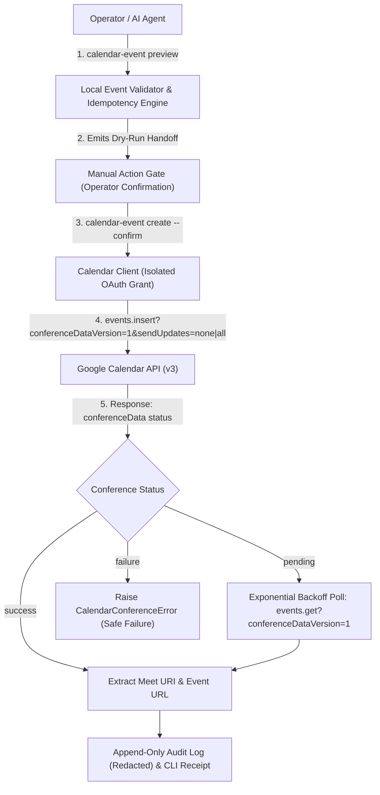

# Google Calendar API & Google Meet Integration: Official Research & Architecture Specification

**Research date:** 2026-09-17  
**Scope:** Primary-source protocol analysis and implementation specification for [GitHub Issue #1](https://github.com/matgCodes/gmail-local/issues/1): *Add Google Calendar event creation with Google Meet links*.  
**Source rule:** Grounded strictly in official Google Developer documentation, RFC specifications, and workspace architectural constraints.

---

## 1. Executive Summary & Core Architectural Decisions

### 1.1 The Destination
Provide a local, auditable CLI and library capability to construct, preview, and create timed Google Calendar events on the authenticated user's primary calendar with uniquely generated Google Meet join links and explicit attendee notification controls behind an interactive Manual Action Gate.

### 1.2 Core Architectural Seams



1. **API Selection: Use Google Calendar API v3, Not Google Meet REST API**:
   * Google Calendar API's `events.insert` natively creates and binds Google Meet spaces via `conferenceData.createRequest` when `conferenceDataVersion=1` is specified.
   * The Google Meet REST API (`meet.googleapis.com/v2`) is dedicated to out-of-calendar space management, moderation settings (chat/screen share locks), active conference control (ending calls), and meeting artifacts (recordings, transcripts, participant logs). It is unnecessary for standard scheduling and should remain out of scope.

2. **Least-Privilege Authorization ([ADR 0003](file:///Users/mag_station/Dev_Tools/Gmail-API/docs/adr/0003-separate-retrieval-and-transmission-credentials.md), [ADR 0004](file:///Users/mag_station/Dev_Tools/Gmail-API/docs/adr/0004-one-oauth-project-two-desktop-clients.md))**:
   * Request scope: `https://www.googleapis.com/auth/calendar.events.owned`.
   * Separate OAuth client secret: `~/.config/gmail-local/client_secret_calendar.json`.
   * Separate macOS Keychain service: `gmail-local-calendar`.
   * Never upgrade or mutate existing Gmail retrieval (`gmail.readonly`), transmission (`gmail.compose`), or modification (`gmail.modify`) credentials.

3. **Deterministic Idempotency & Deduplication**:
   * Google Calendar API supports client-supplied event IDs (`id` field in event resource) formatted as base32hex strings (`[a-v0-9]{5,1024}`).
   * By generating a deterministic SHA-256 fingerprint of normalized event inputs and encoding it into base32hex, network retries return `HTTP 409 Conflict`, allowing safe recovery without creating duplicate calendar entries or orphaned Google Meet links.

4. **Manual Action Gate & Audit Privacy**:
   * External event creation and attendee dispatch have real-world side effects. All write calls require explicit `--confirm` in non-interactive environments or interactive terminal confirmation.
   * Audit logs record event IDs, timestamps, attendee counts, and status, while strictly redacting event descriptions, attendee email addresses, tokens, and Meet join links.

---

## 2. Primary-Source Evidence & Protocol Specification

| Protocol Dimension | Primary-Source Reference | Official Rule / Mechanism | Implementation Requirement |
| :--- | :--- | :--- | :--- |
| **Meet Link Creation** | [Google Calendar API: Create events](https://developers.google.com/workspace/calendar/api/guides/create-events) | Set query parameter `conferenceDataVersion=1` and populate `conferenceData.createRequest`. | Request must omit legacy `hangoutLink` mutations; use `conferenceSolutionKey.type: "hangoutsMeet"`. |
| **Conference Request ID** | [Google Calendar API: Events.insert](https://developers.google.com/workspace/calendar/api/v3/reference/events/insert) | `createRequest.requestId` must be a client-generated unique string for each conference request. | Generate a fresh UUID or idempotency-bound unique key for every creation request. Never reuse across distinct events. |
| **Conference Status Lifecycle** | [ConferenceData Resource](https://developers.google.com/workspace/calendar/api/v3/reference/events#conferenceData) | Conference creation is asynchronous. `createRequest.status.statusCode` returns `pending`, `success`, or `failure`. | If `pending`, execute bounded exponential backoff polling using `events.get(..., conferenceDataVersion=1)` up to 5s deadline. |
| **OAuth Scope** | [Google Calendar API: Scopes](https://developers.google.com/workspace/calendar/api/auth/scopes) | `https://www.googleapis.com/auth/calendar.events.owned` grants access to see, create, edit, and delete events on calendars owned by the user. | Use `calendar.events.owned` as the least-privilege scope. Avoid broader `calendar` or `calendar.events`. |
| **Attendee Notifications** | [Events: insert query parameters](https://developers.google.com/workspace/calendar/api/v3/reference/events/insert) | `sendUpdates` controls notification emails. Values: `all`, `externalOnly`, `none`. (Replaces deprecated `sendNotifications`). | Require explicit CLI flag `--send-updates (none\|externalOnly\|all)`. Default to `none` unless explicitly commanded. |
| **Custom Event IDs** | [Events Resource Schema](https://developers.google.com/workspace/calendar/api/v3/reference/events) | Event `id` accepts custom strings using base32hex encoding (`[a-v0-9]`), length 5–1024 characters. | Derive deterministic base32hex event ID from canonical SHA-256 fingerprint for deduplication. |
| **Meet REST API Scope** | [Google Meet REST API Overview](https://developers.google.com/workspace/meet/api/guides/overview) | Meet REST API manages spaces, co-host roles, moderation locks, conference records, recordings, and transcripts. | Keep Meet REST API out of scope for Calendar event scheduling. |

---

## 3. Google Calendar API vs. Google Meet REST API Comparison

A common architectural trap is attempting to invoke the Google Meet REST API (`meet.googleapis.com`) to generate a meeting link for a calendar invite. Official Google documentation clearly delineates the division of responsibilities:

```
+-----------------------------------------------------------------------------+
|                          SCHEDULING & INVITATIONS                           |
|                         (Google Calendar API v3)                            |
|                                                                             |
|  * Creates Event on Primary Calendar                                        |
|  * Generates native Google Meet space via conferenceData.createRequest      |
|  * Manages attendee list & sends RFC-compliant calendar invitations         |
|  * Binds Start/End time & IANA time zones                                   |
+-----------------------------------------------------------------------------+
                                      |
                                      | (Out of scope for Issue #1)
                                      v
+-----------------------------------------------------------------------------+
|                        CONFERENCE LIFECYCLE & POLICY                        |
|                         (Google Meet REST API v2)                           |
|                                                                             |
|  * Pre-meeting: Space moderation settings (chat lock, screen sharing locks) |
|  * Active meeting: Programmatically ending calls, muting participants       |
|  * Post-meeting: Downloading recordings, Gemini transcripts, smart notes    |
+-----------------------------------------------------------------------------+
```

### Recommendation
For Issue #1, **use only the Google Calendar API (`events.insert`)**. It creates the Google Meet video conference synchronously or with lightweight polling in a single atomic operation without requiring extra API enablement or permissions for `meet.googleapis.com`.

---

## 4. Detailed Data Models & Protocol Payloads

### 4.1 Request Payload Schema for `events.insert`

To create an event with Google Meet, the client sends:

```http
POST https://www.googleapis.com/calendar/v3/calendars/primary/events?conferenceDataVersion=1&sendUpdates=none HTTP/1.1
Authorization: Bearer <access_token>
Content-Type: application/json

{
  "id": "c1a2b3c4d5e6f7a8b9c0d1e2f3",
  "summary": "Executive Strategy Session",
  "description": "Quarterly review notes and architectural roadmap.",
  "start": {
    "dateTime": "2026-09-22T10:00:00-07:00",
    "timeZone": "America/Los_Angeles"
  },
  "end": {
    "dateTime": "2026-09-22T10:35:00-07:00",
    "timeZone": "America/Los_Angeles"
  },
  "attendees": [
    {
      "email": "recipient@example.com",
      "responseStatus": "needsAction"
    }
  ],
  "conferenceData": {
    "createRequest": {
      "requestId": "req-9f8e7d6c-5b4a-3210-fedc-ba9876543210",
      "conferenceSolutionKey": {
        "type": "hangoutsMeet"
      }
    }
  }
}
```

### 4.2 Response Payload & Meeting Link Resolution

Google Calendar API returns the populated `Event` resource. When conference creation succeeds immediately:

```json
{
  "id": "c1a2b3c4d5e6f7a8b9c0d1e2f3",
  "status": "confirmed",
  "htmlLink": "https://www.google.com/calendar/event?eid=...",
  "summary": "Executive Strategy Session",
  "start": {
    "dateTime": "2026-09-22T10:00:00-07:00",
    "timeZone": "America/Los_Angeles"
  },
  "end": {
    "dateTime": "2026-09-22T10:35:00-07:00",
    "timeZone": "America/Los_Angeles"
  },
  "conferenceData": {
    "createRequest": {
      "requestId": "req-9f8e7d6c-5b4a-3210-fedc-ba9876543210",
      "conferenceSolutionKey": {
        "type": "hangoutsMeet"
      },
      "status": {
        "statusCode": "success"
      }
    },
    "entryPoints": [
      {
        "entryPointType": "video",
        "uri": "https://meet.google.com/abc-defg-hij",
        "label": "meet.google.com/abc-defg-hij"
      },
      {
        "entryPointType": "phone",
        "uri": "tel:+1-123-456-7890",
        "pin": "123456#"
      }
    ],
    "conferenceSolution": {
      "key": {
        "type": "hangoutsMeet"
      },
      "name": "Google Meet",
      "iconUri": "https://fonts.gstatic.com/s/i/productlogos/meet_2020q4/v6/web-512dp/logo_meet_2020q4_color_2x_web_512dp.png"
    },
    "conferenceId": "abc-defg-hij"
  }
}
```

### 4.3 Handling the Asynchronous "Pending" State

Google documentation specifies that video conference generation can be asynchronous:
1. If `conferenceData.createRequest.status.statusCode == "pending"`:
   * Do not fail immediately.
   * Execute an exponential backoff loop: query `events.get(calendarId="primary", eventId=event_id, conferenceDataVersion=1)`.
   * Maximum 4 retry attempts (e.g. 500ms, 1s, 2s, 4s; total timeout 7.5s).
   * If status transitions to `"success"`, extract the `video` entry point URI.
2. If status transitions to `"failure"` or times out:
   * Raise a structured `CalendarConferenceError` explaining that the event was created on the calendar, but Google Meet link generation failed on Google's backend.

---

## 5. Idempotency & Deduplication Engine

To prevent accidental double-creation or duplicate meeting spaces upon network retries:

### 5.1 Deterministic Base32hex Event ID
Google Calendar requires custom event IDs to be base32hex lowercase strings (`[a-v0-9]{5,1024}`):

```python
import base64
import hashlib
import json

def generate_calendar_event_id(
    summary: str,
    start_iso: str,
    end_iso: str,
    timezone_str: str,
    attendees: list[str],
    has_meet: bool,
) -> str:
    """Generates a RFC 4648 base32hex event ID from canonical event attributes."""
    canonical_obj = {
        "summary": summary.strip(),
        "start": start_iso.strip(),
        "end": end_iso.strip(),
        "timezone": timezone_str.strip(),
        "attendees": sorted(a.strip().lower() for a in attendees),
        "has_meet": has_meet,
    }
    raw_json = json.dumps(canonical_obj, sort_keys=True, separators=(",", ":"))
    digest = hashlib.sha256(raw_json.encode("utf-8")).digest()
    
    # RFC 4648 base32hex (a-v, 0-9), lowercase, stripped padding
    b32_encoded = base64.b32hexencode(digest).decode("utf-8").lower().rstrip("=")
    return b32_encoded[:64]  # 64-char stable base32hex ID
```

### 5.2 Conflict Handling Workflow
When `events.insert` returns `HTTP 409 Conflict`:
* The client knows this exact event was already created.
* It calls `events.get(calendarId="primary", eventId=event_id, conferenceDataVersion=1)`.
* It returns the existing event receipt and Google Meet link, achieving true network idempotency.

---

## 6. Input Validation & Security Defenses

### 6.1 Injection Defenses
* **CRLF / Null-Byte Rejection:** Hard validation failure if `\r`, `\n`, or `\0` is found in `summary`, attendee emails, or `timeZone`.
* **Attendee Bounds:** Maximum 10 attendees per event (aligned with repository privacy and rate constraints).
* **Time Range Validation:**
  * Parse `start` and `end` as strict ISO 8601 timestamps with explicit UTC offsets or validate against IANA database via Python standard library `zoneinfo.ZoneInfo`.
  * Enforce `end > start`. Reject zero-duration or negative-duration ranges.
* **Redaction in Audit Logs:**
  * Operation `calendar_event_create` logs: `timestamp`, `event_id`, `start`, `end`, `timezone`, `attendee_count`, `has_meet`, and `status`.
  * Never logs: `description`, attendee email addresses, OAuth tokens, or Google Meet URLs.

---

## 7. Proposed CLI Interface & Preview Handoff

```bash
# 1. OAuth Login & Status
gmail-local calendar-login [--client-secret <path>]
gmail-local calendar-status
gmail-local calendar-revoke

# 2. Preview / Dry-Run (No External Mutation)
gmail-local calendar-event preview \
  --summary "Executive medical interview prep" \
  --start "2026-09-22T10:00:00-07:00" \
  --end "2026-09-22T10:35:00-07:00" \
  --timezone "America/Los_Angeles" \
  --attendee "recipient@example.com" \
  --meet \
  --send-updates none

# 3. Execution (Guarded by Manual Action Gate)
gmail-local calendar-event create \
  --summary "Executive medical interview prep" \
  --start "2026-09-22T10:00:00-07:00" \
  --end "2026-09-22T10:35:00-07:00" \
  --timezone "America/Los_Angeles" \
  --attendee "recipient@example.com" \
  --meet \
  --send-updates all \
  --confirm
```

### Standard Send / Create Handoff Block
```markdown
=========================== CALENDAR EVENT HANDOFF ===========================
Event Fingerprint:  b4c7d9e1f2a348...
Event ID (Target):  a0b1c2d3e4f5g6h7i8j9k0...
Summary:            Executive medical interview prep
Start Time:         2026-09-22T10:00:00-07:00 (America/Los_Angeles)
End Time:           2026-09-22T10:35:00-07:00 (America/Los_Angeles)
Duration:           35 minutes
Google Meet:        ENABLED (Will generate unique conference space)
Attendees:          1 recipient(s)
Send Updates:       ALL (Google Calendar will send email invitations)

To authorize creation on your primary Google Calendar, run:
  gmail-local calendar-event create \
    --summary "Executive medical interview prep" \
    --start "2026-09-22T10:00:00-07:00" \
    --end "2026-09-22T10:35:00-07:00" \
    --timezone "America/Los_Angeles" \
    --attendee "recipient@example.com" \
    --meet \
    --send-updates all \
    --confirm
==============================================================================
```

---

## 8. Documentation-Derived Test Matrix

### Offline Unit & Contract Tests
1. **Payload Construction**:
   * Verify `--meet` populates `conferenceData.createRequest` with `type: "hangoutsMeet"` and unique `requestId`.
   * Verify omission of `--meet` leaves `conferenceData` empty.
   * Verify `conferenceDataVersion=1` query parameter is always present when `--meet` is requested.
2. **Idempotency & Fingerprinting**:
   * Verify two identical event definitions produce identical base32hex event IDs.
   * Verify changing any parameter (summary, time, attendee, timezone) changes the event ID.
3. **Input Validation & Safety**:
   * Reject CRLF in summary, attendee email, or timezone.
   * Reject `end <= start`.
   * Reject invalid IANA timezone strings.
   * Reject attendee count > 10.
4. **Conference Lifecycle Handling**:
   * Mock immediate `success`: verify Meet URI is parsed and returned.
   * Mock initial `pending` transitioning to `success`: verify backoff polling and eventual success.
   * Mock persistent `pending` / `failure`: verify graceful error raising without crashing.
   * Mock `HTTP 409 Conflict`: verify fallback `events.get` retrieval.
5. **Manual Action Gate & Audit Redaction**:
   * Verify non-interactive execution without `--confirm` fails immediately with `ManualActionGateViolationError`.
   * Verify audit log entries contain zero PII, event descriptions, or Meet links.

---

## 9. Conclusion

This intensive research establishes that:
1. Google Calendar API `events.insert` with `conferenceDataVersion=1` and `conferenceSolutionKey.type: "hangoutsMeet"` is the sole required, standards-compliant mechanism for creating calendar events with Google Meet links.
2. The Google Meet REST API is intentionally out of scope.
3. Strict credential isolation (`calendar.events.owned`), deterministic base32hex deduplication, and the interactive Manual Action Gate fulfill all safety and architectural requirements of Issue #1.
